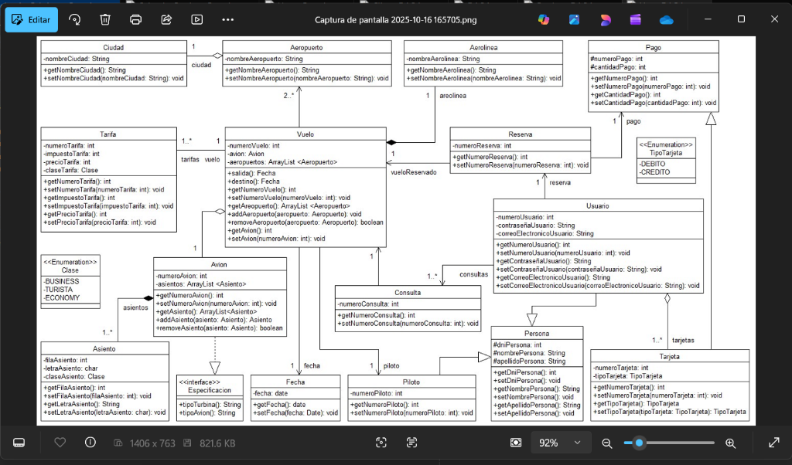

# SkyPass — Sistema de Reserva de Vuelos

<div align="center">


**API REST + Frontend integrado para gestión y reserva de vuelos internacionales y domésticos.**

[Características](#-características) · [Arquitectura](#️-arquitectura) · [Instalación](#-instalación) · [API Endpoints](#-api-endpoints) · [Modelo de Datos](#-modelo-de-datos) · [Tecnologías](#-tecnologías)

</div>

---

## Características

-  **Búsqueda de vuelos** con filtros por origen, destino y fecha de salida
-  **Carrito de reservas** para seleccionar vuelos y clases (Turista, Primera Clase, Económica)
-  **Proceso de pago** con validación de tarjeta y resumen de costos
-  **Historial de reservas** con detalle de pagos y vuelos confirmados
-  **Registro e inicio de sesión** de usuarios
-  **Datos de prueba** precargados automáticamente al iniciar (ciudades, aeropuertos, aerolíneas, vuelos y tarifas)
-  **Apertura automática del navegador** al iniciar la aplicación
-  **Diseño responsivo** con Bootstrap 5

---

##  Arquitectura

El proyecto sigue una **arquitectura de capas** con patrón genérico base para servicios y controladores:

```
src/main/java/ayala/apiVuelos/
├── ApiVuelosApplication.java          # Punto de entrada + auto-open browser
├── config/
│   ├── DataInitializer.java           # Siembra de datos de prueba (CommandLineRunner)
│   └── UsuarioPersonaMigration.java   # Migración de datos
├── controller/
│   ├── BaseController.java            # Interfaz genérica CRUD
│   ├── BaseControllerImpl.java        # Implementación genérica (GET, POST, PUT, DELETE)
│   ├── ReservaController.java         # Controlador con lógica custom de reservas
│   ├── UiController.java              # Sirve la vista HTML (Thymeleaf)
│   └── ...Controller.java             # Controladores específicos por entidad
├── dto/
│   └── ReservaRequest.java            # DTO para creación de reservas
├── entities/
│   ├── Base.java                      # Entidad base con ID autogenerado
│   ├── Vuelo.java                     # Vuelo con aeropuertos, tarifas, aerolínea
│   ├── Reserva.java                   # Reserva vinculando usuario + vuelo + pago
│   ├── Usuario.java                   # Usuario con persona embebida
│   ├── Tarifa.java                    # Tarifas por clase (Turista, Primera, Económica)
│   ├── Tarjeta.java                   # Medio de pago
│   └── ...                            # Aerolínea, Aeropuerto, Ciudad, Avión, Piloto, etc.
├── repositories/
│   ├── BaseRepository.java            # Repositorio genérico (JpaRepository)
│   └── ...Repository.java             # Repositorios por entidad
└── services/
    ├── BaseService.java               # Interfaz genérica de servicios
    ├── BaseServiceImpl.java           # Implementación genérica CRUD
    └── ...ServiceImpl.java            # Servicios con lógica de negocio

src/main/resources/
├── application.properties             # Configuración del servidor y base de datos
├── static/                            # Frontend (HTML + CSS + JS vanilla)
│   ├── index.html                     # SPA principal
│   ├── css/style.css                  # Estilos inspirados en Booking.com
│   └── js/
│       ├── api.js                     # Servicio HTTP (singleton)
│       ├── auth.js                    # Autenticación en cliente
│       └── app.js                     # Lógica de la aplicación (SPA routing, renderizado)
└── templates/
    └── index.html                     # Template Thymeleaf (fallback)
```

---

##  Instalación

### Prerrequisitos

| Herramienta | Versión mínima |
|---|---|
| **Java (JDK)** | 26+ |
| **MySQL** | 8.0+ |
| **Gradle** | Incluido (Gradle Wrapper) |

### 1. Clonar el repositorio

```bash
git clone https://github.com/tu-usuario/apiVuelos.git
cd apiVuelos
```

### 2. Configurar la base de datos

Crear la base de datos en MySQL:

```sql
CREATE DATABASE vuelos_persistence;
```

> [!NOTE]
> Por defecto, el proyecto se conecta a `localhost:3306` con usuario `root` y sin contraseña.
> Si tu configuración es diferente, editar `src/main/resources/application.properties`:

```properties
spring.datasource.url=jdbc:mysql://localhost:3306/vuelos_persistence
spring.datasource.username=root
spring.datasource.password=tu_contraseña
```

### 3. Ejecutar la aplicación

```bash
# Windows
.\gradlew.bat bootRun

# Linux / macOS
./gradlew bootRun
```

La aplicación se inicia en **http://localhost:9000** y abre el navegador automáticamente.

### 4. Usuario de prueba

Al primer arranque, se siembran datos de prueba incluyendo un usuario predeterminado:

| Campo | Valor |
|---|---|
| **Email** | `admin@vuelos.com` |
| **Contraseña** | `admin123` |

---

##  API Endpoints

Todos los endpoints están bajo el prefijo `/api/v1`. Cada entidad expone un CRUD genérico heredado de `BaseControllerImpl`.

### CRUD Genérico (por entidad)

| Método | Ruta | Descripción |
|---|---|---|
| `GET` | `/api/v1/{entidad}` | Listar todos |
| `GET` | `/api/v1/{entidad}/paged` | Listar paginado |
| `GET` | `/api/v1/{entidad}/{id}` | Obtener por ID |
| `POST` | `/api/v1/{entidad}` | Crear nuevo |
| `PUT` | `/api/v1/{entidad}/{id}` | Actualizar por ID |
| `DELETE` | `/api/v1/{entidad}/{id}` | Eliminar por ID |

### Entidades disponibles

| Entidad | Ruta base |
|---|---|
| Vuelos | `/api/v1/vuelos` |
| Reservas | `/api/v1/reservas` |
| Usuarios | `/api/v1/usuarios` |
| Tarjetas (Pagos) | `/api/v1/tarjetas` |
| Ciudades | `/api/v1/ciudades` |
| Aeropuertos | `/api/v1/aeropuertos` |
| Aerolíneas | `/api/v1/aerolineas` |
| Aviones | `/api/v1/aviones` |
| Pilotos | `/api/v1/pilotos` |
| Tarifas | `/api/v1/tarifas` |
| Asientos | `/api/v1/asientos` |
| Personas | `/api/v1/personas` |
| Consultas | `/api/v1/consultas` |
| Pagos | `/api/v1/pagos` |

### Endpoints especiales

#### Crear reserva
```http
POST /api/v1/reservas
Content-Type: application/json

{
  "numeroReserva": 12345,
  "usuarioId": 1,
  "vueloId": 1,
  "pagoId": 1
}
```

### Ejemplo: consultar vuelos

```bash
curl http://localhost:9000/api/v1/vuelos
```

<details>
<summary> Respuesta de ejemplo</summary>

```json
[
  {
    "id": 1,
    "numeroVuelo": 1001,
    "salida": "2026-06-02T18:00:00",
    "destino": "2026-06-03T06:30:00",
    "aerolinea": {
      "id": 1,
      "nombreAerolinea": "Aerolíneas Argentinas"
    },
    "aeropuertos": [
      {
        "id": 1,
        "nombreAeropuerto": "Aeropuerto Internacional de Ezeiza (EZE)",
        "ciudad": { "id": 1, "nombreCiudad": "Buenos Aires" }
      },
      {
        "id": 3,
        "nombreAeropuerto": "Aeropuerto Adolfo Suárez Madrid-Barajas (MAD)",
        "ciudad": { "id": 2, "nombreCiudad": "Madrid" }
      }
    ],
    "tarifas": [
      { "id": 1, "numeroTarifa": 101, "precioTarifa": 1200, "impuestoTarifa": 150, "claseTarifa": "TURISTA" },
      { "id": 2, "numeroTarifa": 102, "precioTarifa": 2500, "impuestoTarifa": 300, "claseTarifa": "FIRSTCLASS" },
      { "id": 3, "numeroTarifa": 103, "precioTarifa": 950, "impuestoTarifa": 100, "claseTarifa": "ECONOMICA" }
    ]
  }
]
```
</details>

---

##  Modelo de Datos



### Enumeraciones

| Enum | Valores |
|---|---|
| `Clase` | `TURISTA`, `FIRSTCLASS`, `ECONOMICA` |
| `TipoTarjeta` | `CREDITO`, `DEBITO` |
| `Especificacion` | `TURISTA`, `FIRSTCLASS`, `ECONOMICA` |

---

##  Tecnologías

### Backend
- **Java 26** — Lenguaje principal
- **Spring Boot 4.0.6** — Framework web y DI
- **Spring Data JPA** — Persistencia ORM con Hibernate
- **MySQL** — Base de datos relacional
- **Lombok** — Reducción de boilerplate (getters, setters, constructores)
- **Gradle** — Build tool y gestión de dependencias

### Frontend
- **HTML5** — Estructura semántica
- **CSS3** — Estilos custom (diseño inspirado en Booking.com)
- **JavaScript (ES6+)** — Lógica de la SPA (vanilla, sin frameworks)
- **Bootstrap 5.3.3** — Componentes y layout responsivo
- **Bootstrap Icons** — Iconografía
- **Google Fonts (Inter)** — Tipografía moderna

---

##  Configuración

El archivo `application.properties` permite ajustar:

```properties
# Puerto del servidor (default: 9000)
server.port=9000

# Base de datos MySQL
spring.datasource.url=jdbc:mysql://localhost:3306/vuelos_persistence
spring.datasource.username=root
spring.datasource.password=

# Hibernate DDL (update: actualiza schema sin perder datos)
spring.jpa.hibernate.ddl-auto=update

# Abrir navegador al iniciar (true/false)
app.ui.open-browser=true
```

---

##  Contribución

1. Hacer fork del repositorio
2. Crear una rama para tu feature (`git checkout -b feature/nueva-funcionalidad`)
3. Commitear tus cambios (`git commit -m 'Agrego nueva funcionalidad'`)
4. Push a la rama (`git push origin feature/nueva-funcionalidad`)
5. Abrir un Pull Request

---

##  Autor

**Ayala Poquet, Ignacio**

---

##  Licencia

Este proyecto es de uso académico y personal.
